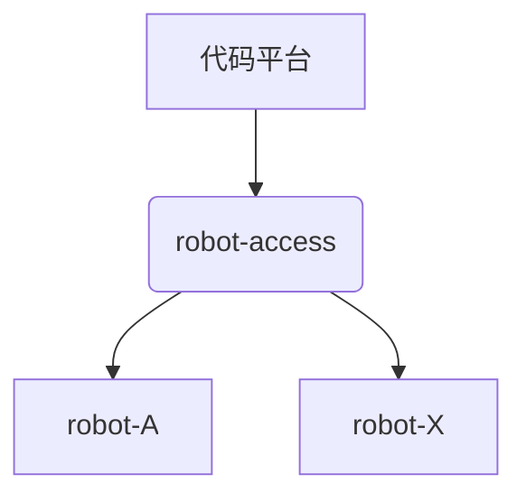
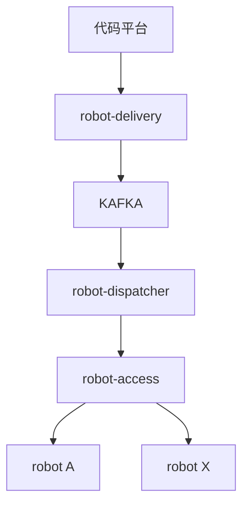

# 社区机器人支持忙时5000PR/小时的方案验证

## 背景
由于原机器人架构采用直接透传的方式，将来自代码平台的所有请求直接转发给特定的机器人。当瞬时并发请求较高时，可能因超出下游robot处理能力导致消息丢失。

为解决此问题，新升级架构采用kafka作为消息队列，缓存所有请求，robot-dispatcher控制下发速度。

现对新升级架构进行压力测试，验证robot-dispatcher控制下发速度的精确性和可靠性。

#### 原架构



#### 升级架构



## 准备工作

#### robot-dispatcher
整个系统需满足处理5000PR每小时，每个PR平均100个事件的性能要求，即138个事件每秒。
因此设置robot-dispatcher速度限制为每秒处理**140**个事件。

robot-dispatcher每发送完配置个数的事件时，便会记录相关日志：
```go
	if size > 0 && d.sentNum >= size {
		now := time.Now()

		if v := d.startTime.Add(time.Second); v.After(now) {
			du := v.Sub(now)
			time.Sleep(du)

			logrus.Debugf(
				"will sleep %s after sending %d events",
				du.String(), d.sentNum,
			)
		} else {
			logrus.Debugf(
				"It took %s to send %d events",
				now.Sub(d.startTime).String(), d.sentNum,
			)
		}

		d.sentNum = 0
	}
```

#### 测试机器人
部署一个测试机器人robot-test用于接收来自robot-access的事件，测试机器人解析request并直接打印相关参数进行计数。

```go
return fmt.Errorf("request num %s", e.Comment.Body)
```

#### 压测脚本
并发发送14000个请求，按照100个一组，分批次进行。
脚本核心逻辑如下：

```go
	requestNum := 1
	for {
	    // 设置e.Comment.Body的值为requestNum
		req := buildRequest(plat, o.endpoint, requestNum)

		wg.Add(1)
		go send(req)

		if requestNum%100 == 0 {
			wg.Wait()
			logrus.Infof("send request count:%d", requestNum)

			if requestNum == 14000 {
				wg.Wait()
				break
			}
		}

		requestNum++
	}
```

## 验证过程
#### 发送请求

执行压测脚本，向robot-delivery发送请求，日志如下：
```
time="2023-01-16T15:19:09+08:00" level=info msg="send request count:100" 
time="2023-01-16T15:19:09+08:00" level=info msg="send request count:200" 
time="2023-01-16T15:19:10+08:00" level=info msg="send request count:300" 

...

time="2023-01-16T15:20:38+08:00" level=info msg="send request count:13800"
time="2023-01-16T15:20:39+08:00" level=info msg="send request count:13900"
time="2023-01-16T15:20:40+08:00" level=info msg="send request count:14000"

```
可以看到，在91秒左右的时间将14000个请求发送完毕。

#### robot-delivery
查看robot-delivery日志，发送成功的有14000条。
```
{"component":"robot-gitee-hook-delivery","event-id":"1673853639165","event-type":"Note Hook","file":"/go/src/github.com/opensourceways/robot-gitee-hook-delivery/delivery.go:62","func":"main.(*delivery).publish.func1","level":"debug","msg":"publish message to topic(robot-gitee-mindspore) successfully","time":"2023-01-16T07:20:40Z"}
{"component":"robot-gitee-hook-delivery","event-id":"1673853639165","event-type":"Note Hook","file":"/go/src/github.com/opensourceways/robot-gitee-hook-delivery/delivery.go:62","func":"main.(*delivery).publish.func1","level":"debug","msg":"publish message to topic(robot-gitee-mindspore) successfully","time":"2023-01-16T07:20:40Z"}
{"component":"robot-gitee-hook-delivery","event-id":"1673853639165","event-type":"Note Hook","file":"/go/src/github.com/opensourceways/robot-gitee-hook-delivery/delivery.go:62","func":"main.(*delivery).publish.func1","level":"debug","msg":"publish message to topic(robot-gitee-mindspore) successfully","time":"2023-01-16T07:20:40Z"}
root@ubuntu-develop-for-yangwei:~/kubeconfig# 
root@ubuntu-develop-for-yangwei:~/kubeconfig# cat robot_delivery | grep '2023-01-16T07:' | grep 'successfully' | wc -l
14000
```


#### robot-dispatcher
查看robot-dispatcher日志
```
{"component":"robot-hook-dispatcher","file":"/go/src/github.com/opensourceways/robot-hook-dispatcher/dispatcher.go:89","func":"main.(*dispatcher).speedControl","level":"debug","msg":"will sleep 301.992576ms after sending 140 events","time":"2023-01-16T07:19:10Z"}
{"component":"robot-hook-dispatcher","file":"/go/src/github.com/opensourceways/robot-hook-dispatcher/dispatcher.go:89","func":"main.(*dispatcher).speedControl","level":"debug","msg":"will sleep 402.791187ms after sending 140 events","time":"2023-01-16T07:19:11Z"}
{"component":"robot-hook-dispatcher","file":"/go/src/github.com/opensourceways/robot-hook-dispatcher/dispatcher.go:89","func":"main.(*dispatcher).speedControl","level":"debug","msg":"will sleep 416.085828ms after sending 140 events","time":"2023-01-16T07:19:12Z"}

...

{"component":"robot-hook-dispatcher","file":"/go/src/github.com/opensourceways/robot-hook-dispatcher/dispatcher.go:89","func":"main.(*dispatcher).speedControl","level":"debug","msg":"will sleep 441.973407ms after sending 140 events","time":"2023-01-16T07:20:48Z"}
{"component":"robot-hook-dispatcher","file":"/go/src/github.com/opensourceways/robot-hook-dispatcher/dispatcher.go:89","func":"main.(*dispatcher).speedControl","level":"debug","msg":"will sleep 439.616615ms after sending 140 events","time":"2023-01-16T07:20:49Z"}
{"component":"robot-hook-dispatcher","file":"/go/src/github.com/opensourceways/robot-hook-dispatcher/dispatcher.go:89","func":"main.(*dispatcher).speedControl","level":"debug","msg":"will sleep 432.007048ms after sending 140 events","time":"2023-01-16T07:20:50Z"}
```

开始处理时间为2023-01-16T07:19:10Z（时区问题，+8h），处理结束时间为2023-01-16T07:20:50Z。
```
root@ubuntu-develop-for-yangwei:~/kubeconfig# cat robot_dispatcher | grep '2023-01-16T07' | grep 'will sleep' | wc -l
100
```
一共100条日志记录，符合每秒处理140个事件的预期。


#### robot-test
查看robot-test的日志：

```
{"action":"comment","commenter":"weiwei123444","component":"test","error":"request num 100","event-type":"Note Hook","event_id":"1673853549257","file":"/go/pkg/mod/github.com/opensourceways/community-robot-lib@v0.0.0-20221212062947-85a66b110688/robot-gitee-framework/dispatcher.go:156","func":"github.com/opensourceways/community-robot-lib/robot-gitee-framework.(*dispatcher).handleNoteEvent","level":"error","msg":"","time":"2023-01-16T07:19:09Z","url":"https://gitee.com/YwHql/test/pulls/33#note_15571877"}
{"action":"comment","commenter":"weiwei123444","component":"test","error":"request num 21","event-type":"Note Hook","event_id":"1673853549250","file":"/go/pkg/mod/github.com/opensourceways/community-robot-lib@v0.0.0-20221212062947-85a66b110688/robot-gitee-framework/dispatcher.go:156","func":"github.com/opensourceways/community-robot-lib/robot-gitee-framework.(*dispatcher).handleNoteEvent","level":"error","msg":"","time":"2023-01-16T07:19:09Z","url":"https://gitee.com/YwHql/test/pulls/33#note_15571877"}
{"action":"comment","commenter":"weiwei123444","component":"test","error":"request num 1","event-type":"Note Hook","event_id":"1673853549248","file":"/go/pkg/mod/github.com/opensourceways/community-robot-lib@v0.0.0-20221212062947-85a66b110688/robot-gitee-framework/dispatcher.go:156","func":"github.com/opensourceways/community-robot-lib/robot-gitee-framework.(*dispatcher).handleNoteEvent","level":"error","msg":"","time":"2023-01-16T07:19:09Z","url":"https://gitee.com/YwHql/test/pulls/33#note_15571877"}

...

{"action":"comment","commenter":"weiwei123444","component":"test","error":"request num 14000","event-type":"Note Hook","event_id":"1673853639165","file":"/go/pkg/mod/github.com/opensourceways/community-robot-lib@v0.0.0-20221212062947-85a66b110688/robot-gitee-framework/dispatcher.go:156","func":"github.com/opensourceways/community-robot-lib/robot-gitee-framework.(*dispatcher).handleNoteEvent","level":"error","msg":"","time":"2023-01-16T07:20:49Z","url":"https://gitee.com/YwHql/test/pulls/33#note_15571877"}
{"action":"comment","commenter":"weiwei123444","component":"test","error":"request num 13999","event-type":"Note Hook","event_id":"1673853639165","file":"/go/pkg/mod/github.com/opensourceways/community-robot-lib@v0.0.0-20221212062947-85a66b110688/robot-gitee-framework/dispatcher.go:156","func":"github.com/opensourceways/community-robot-lib/robot-gitee-framework.(*dispatcher).handleNoteEvent","level":"error","msg":"","time":"2023-01-16T07:20:49Z","url":"https://gitee.com/YwHql/test/pulls/33#note_15571877"}
{"action":"comment","commenter":"weiwei123444","component":"test","error":"request num 13998","event-type":"Note Hook","event_id":"1673853639165","file":"/go/pkg/mod/github.com/opensourceways/community-robot-lib@v0.0.0-20221212062947-85a66b110688/robot-gitee-framework/dispatcher.go:156","func":"github.com/opensourceways/community-robot-lib/robot-gitee-framework.(*dispatcher).handleNoteEvent","level":"error","msg":"","time":"2023-01-16T07:20:49Z","url":"https://gitee.com/YwHql/test/pulls/33#note_15571877"}
```

可以看到：
开始接收时间为2023-01-16T07:19:09Z，request num分别为100，21，1。
接收完成时间为2023-01-16T07:20:49Z，request num分别为14000，13999，13998。

```
root@ubuntu-develop-for-yangwei:~/kubeconfig# cat robot_test | grep '2023-01-16T07:' |grep 'request num' |  wc -l
14000
```
robot-test日志总体计数为14000，花费100秒，与robot-dispatcher速度保持一致。

## 结论

实验结果基本符合100秒接收14000个事件请求的速度控制设置，由此可见dispatcher达到了精确控制事件下发速度的目的，达成系统设计预期。
